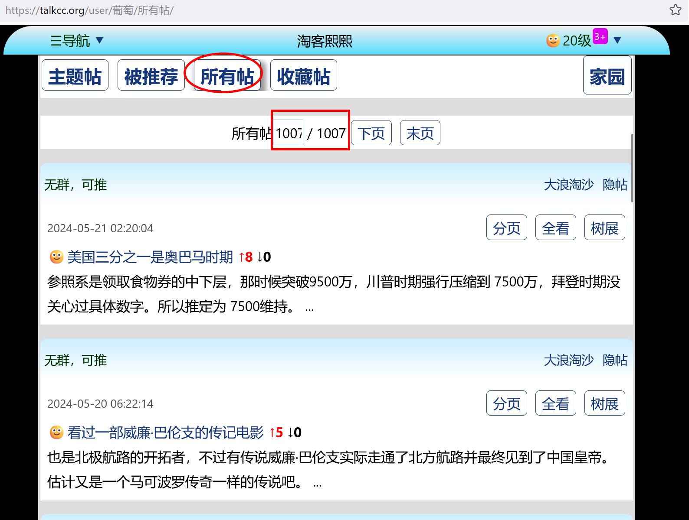

# cc-spider
一个专用于抓取西西河大佬全部文章的爬虫工具

## 关于西西河
西西河是一个知名的海外华人社区论坛，名称应该来源于网站域名cchere.com。西西河成立于2003年，最初是一个海外华人和留学生的聚集地，讨论的话题涵盖了政治、经济、历史、文化等多个领域。西西河的用户群体包括了许多专业人士和学者，因此论坛上的讨论具有较高的学术性和专业性，并以其高质量的内容和深入的讨论而闻名。(以上由GPT生成)

西西河论坛上著名的大佬包括wxmang、万里风中虎、葡萄、陈经、马伯庸、忘情......（排名不分先后）。尽管有些大名已渐渐隐匿江湖，但仍有很多ID至今活跃在互联网上。

## 关于cc-spider
为了收集河内大佬留下的诸多优秀文字，设计了cc-spider这个工具。特点：
- 无需安装，单文件直接使用（只需python环境）
- 支持linux/windows/mac 或云端环境下使用
- 根据配置，自动下载西河指定ID的全部发言，并将内容保存到一个word文档中
- 可以指定从任意页面开始收集作者发言
- 原文章中的链接及图片也会相应保存到word文档中


## 运行方法
- clone本项目或单独下载cc-spider.py文件
```bash
git clone https://github.com/pisces76/cc-spider.git
```

- 安装依赖库
```bash
pip install beautifulsoup4 requests python-docx
```

- 网络环境  
请确保你有稳定的网络可以正常访问西西河论坛。实际上西河有多个网址可以访问，本项目中使用的是：https://talkcc.org/。  
如果你的环境无法访问该网址，可以尝试如下其它网址，并将可用网址更新到参数表的[FIXED_URL] 中（详见下节）。  
https://www.talkcc.com   
https://www.talkcc.net  
https://www.talkcc.org  
https://www.ccthere.com   
https://www.ccthere.net  
https://www.ccthere.org


- 配置参数  
以抓取葡萄大佬的文章为例，首先进入葡萄的西西河家园，点击 [所有帖](https://talkcc.org/user/%E8%91%A1%E8%90%84/%E6%89%80%E6%9C%89%E5%B8%96/)。 从中可以观察到，葡萄的文章截止2024年5月25日已经多达1007页。但是由于前期有873页的文章(2014年以前)已无内容，所以抓取页面从第874页开始。  


  
    
用文本编辑器打开cc-spider.py文件，从第10行开始，可配置以下参数：

```
USER = '葡萄'                               #配置用户名
SLEEP_TIME = 5                              #抓取每篇文章的时间间隔，单位秒
start_page = 874                            #起始页面，通常可从1开始
end_page   = 1007                           #终止页面，如上图红框2中数字所示
FIXED_URL  = 'https://talkcc.org/'          #固定URL
```

- 运行
```
python cc-spider.py
```
如果下载的文章内容过多，担心因终端连接断开影响抓取，可以选择后台运行的方法：
```
nohup python cc-spider.py &
```

运行过程中的日志保存为cc-spider.log文件，里面记录了程序运行的详细信息。  
全部运行结束后，会将作者所有文章保存在同目录下的"西西河-{USER}-专辑.docx"文件中。  
本项目中包含了我抓取的 [葡萄] 从2014年12月15日到2024年5月25日的全部发言帖，合计2000余篇文章，80+万字，保存为【西西河-葡萄-专辑.docx】。

## 注意事项
- 新生成的word文档中字体会比较丑(原因不明)，由于docx库设置字体的方法比较繁琐，所以建议打开文档，ctrl+A选择全文，然后直接修改字体为宋体就可以了。
- 如果抓取过程中遇到网络问题或程序异常中断，可以通过查看日志定位到已爬取到第x页，然后修改文件配置参数中的start_page = x，然后重新运行，程序会继续从该页开始爬取并追加到文档中。
- 为了防止触发网站封控，所以默认爬取速度设定为每篇文章间隔5s。以葡萄的2000篇文章为例，大约耗时3小时不到。我试过用3s间隔爬取，也没问题。再短就没试过了。


## 其它
- 这个程序，从突发想象到基本完成用了大约3天的碎片化时间，期间GPT也帮了不少忙(我主要用的是deepseek-coder)。不足之处肯定也不少，欢迎大家下载试用，并提出宝贵意见。  
- 如果发现bug，请提交终端输出信息或cc-spider.log中出错信息。我有时间会尽量解决。


## To do
1. 断点续传
2. 命令行参数传入
3. 图形界面
4. 统计信息
5. 添加目录
6. 增加代理参数  
...


## Buy me a coffee

### 微信支付


### 支付宝


